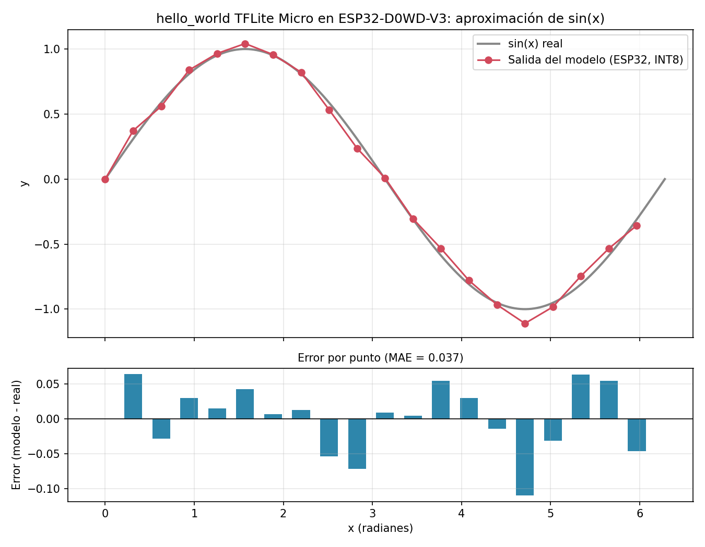

# IA en un ESP32: primeros pasos con TinyML

Registro de cómo preparar un ESP32 clásico (ESP32-D0WD-V3) en Windows para ejecutar modelos de IA
con **TensorFlow Lite Micro** usando **ESP-IDF** y **VS Code**. Incluye el entorno, las pruebas
realizadas, los problemas encontrados y sus soluciones, y los resultados del `hello_world`.

Fecha de las pruebas: 21 de septiembre de 2026.

## Contenido del repositorio

| Archivo | Descripción |
|---|---|
| `README.md` | Este documento |
| `hello_world_results.csv` | Salida del modelo en el ESP32 (un ciclo de 20 puntos) |
| `plot_results.py` | Script que genera la gráfica a partir del CSV |
| `hello_world_plot.png` | Gráfica generada |

## Hardware y software

**Placa**
- Chip: ESP32-D0WD-V3 (revisión v3.1), Xtensa dual core, WiFi y Bluetooth, cristal de 40 MHz.
- Flash: 4 MB detectados (el proyecto `blink` la configuró a 2 MB por defecto).
- Sin PSRAM. Sin cámara ni micrófono.
- Puerto serie: `COM3`.

**Software**
- Windows, VS Code con la extensión **ESP-IDF 2.2.0** (Espressif Systems).
- **ESP-IDF v5.5.5**, instalado con el ESP-IDF Installation Manager (EIM) en `C:\esp`.
- Herramientas en `C:\Espressif\tools`. Entorno Python virtual en `C:\Espressif\tools\python\v5.5.5\venv`.
- Python del sistema: 3.11.8 (oficial, `C:\Program Files\Python311`).
- esptool v4.12.0.

## Por qué un ESP32 clásico limita la IA

El ESP32-S3 añade instrucciones vectoriales (SIMD) que aceleran las convoluciones y las
multiplicaciones-acumulación, y muchas placas S3 traen PSRAM. El ESP32 clásico (D0WD) no tiene
ninguna de las dos cosas, así que solo caben modelos muy pequeños:

- Adecuado: clasificación de sensores, gestos, palabras clave, imágenes muy pequeñas.
- No adecuado: LLM de los repositorios listados más abajo, o detección de objetos tipo YOLO.

## Instalación paso a paso

### 1. Extensión de VS Code

1. Extensiones (`Ctrl+Shift+X`) → buscar **ESP-IDF** (Espressif Systems) → instalar.
2. Si aparece el aviso *"No standard ESP-IDF project was found..."*, pulsar **Activate Anyway**.
3. `Ctrl+Shift+P` → **ESP-IDF: Open ESP-IDF Installation Manager**.

### 2. Instalar ESP-IDF con el Installation Manager

1. Mirror: **Github**.
2. Versión: **v5.5.5** (última de la serie 5.x). Se evitó v6.x por posibles incompatibilidades con
   componentes como TFLite Micro, aunque no se ha comprobado.
3. Ruta: `C:\esp`. Casilla "Install on a different drive": desmarcada.
4. Tamaño aproximado: 2.85 GB, entre 10 y 45 minutos.
5. Al terminar: **Keep** para conservar el paquete offline.
6. En VS Code: `Ctrl+Shift+P` → **ESP-IDF: Select Current ESP-IDF Version** → v5.5.5.

### 3. Problema encontrado: el instalador usa el Python de MSYS2

La primera instalación falló al crear el entorno Python:

```
Failed to install Python environment: failed to install requirements from file
"C:\esp\v5.5.5\esp-idf\tools\requirements\requirements.core.txt":
El sistema no puede encontrar la ruta especificada. (os error 3)
```

Las herramientas (compiladores, cmake, ninja...) se habían instalado bien. El log mostraba:

```
Found python3 on Windows PATH (alias-free): C:\msys64\ucrt64\bin\python3.exe
```

**Causa probable:** el instalador busca un ejecutable llamado `python3.exe`. El Python de
python.org solo instala `python.exe`, así que el instalador encontró el `python3.exe` de MSYS2, que
ESP-IDF no soporta.

**Solución aplicada:**

1. Crear `python3.exe` junto al Python oficial (PowerShell como administrador):
   ```powershell
   Copy-Item "C:\Program Files\Python311\python.exe" "C:\Program Files\Python311\python3.exe"
   ```
2. Comprobar que ahora sale primero el Python correcto:
   ```powershell
   where.exe python3
   ```
   (Nota: en PowerShell `where` es un alias de otro comando; hay que usar `where.exe`.)
3. Cerrar VS Code y el instalador, y borrar lo que quedó a medias:
   ```powershell
   Remove-Item -Recurse -Force C:\esp\v5.5.5
   Remove-Item -Recurse -Force C:\Espressif\tools\python
   ```
4. Repetir la instalación desde el Installation Manager. Esta vez terminó con éxito.

## Uso diario

### Abrir el entorno ESP-IDF

El entorno (`idf.py`, `esptool.py`...) solo existe en terminales que lo hayan activado. Opciones:

- `Ctrl+Shift+P` → **ESP-IDF: Open ESP-IDF Terminal**.
- O, en cualquier PowerShell:
  ```powershell
  & 'C:\Espressif\tools\Microsoft.v5.5.5.PowerShell_profile.ps1'
  ```
  Debe aparecer `(venv)` al principio de la línea.

Si el menú lateral y la barra inferior de la extensión salen vacíos, hay que abrir con
**File → Open Folder** la carpeta del proyecto (la que contiene `CMakeLists.txt` y `main/`),
no la carpeta superior.

### Comandos básicos

```powershell
idf.py set-target esp32          # una vez por proyecto
idf.py build                     # compilar (no necesita la placa)
idf.py -p COM3 flash monitor     # flashear y abrir monitor (necesita la placa)
```

- Para saber el puerto: `[System.IO.Ports.SerialPort]::GetPortNames()`.
- Si se queda en "Connecting...": mantener pulsado el botón **BOOT** hasta que empiece a subir.
- Salir del monitor: `Ctrl+]`. En teclado español es incómodo y puede dar
  `Unknown menu character ']'`; alternativa: **`Ctrl+T` y luego `X`**.
- El subrayado rojo de `#include "driver/gpio.h"` es solo IntelliSense y no afecta a la
  compilación. Se arregla compilando una vez y ejecutando
  **ESP-IDF: Add VS Code Configuration Folder**.

## Guía de ejecución (de cero a resultado)

Flujo completo para compilar y ejecutar cualquier proyecto ESP-IDF en la placa.

1. **Conectar la placa** por USB con un cable de datos (no solo de carga). Si no aparece ningún
   puerto COM, instalar el driver CP210x o CH340 según el chip USB de la placa.
2. **Averiguar el puerto:**
   ```powershell
   [System.IO.Ports.SerialPort]::GetPortNames()
   ```
   En este caso: `COM3`.
3. **Abrir la terminal con el entorno ESP-IDF** (debe aparecer `(venv)`):
   `Ctrl+Shift+P` → **ESP-IDF: Open ESP-IDF Terminal**.
4. **Entrar en la carpeta del proyecto** (la que contiene `CMakeLists.txt`):
   ```powershell
   cd C:\Users\Usuario\Desktop\esp32\hello_world
   ```
5. **Elegir el chip destino** (solo la primera vez, o al cambiar de chip):
   ```powershell
   idf.py set-target esp32
   ```
6. **Compilar** (no necesita la placa):
   ```powershell
   idf.py build
   ```
   La primera compilación es lenta; las siguientes solo recompilan lo que cambió.
7. **Flashear y abrir el monitor serie** (necesita la placa):
   ```powershell
   idf.py -p COM3 flash monitor
   ```
   Si se queda en `Connecting...`, mantener pulsado **BOOT** hasta que empiece a subir.
8. **Ver la salida** en el monitor. Para reiniciar la placa sin reflashear: pulsar **EN/RST**.
9. **Salir del monitor:** `Ctrl+]`, o `Ctrl+T` y luego `X` en teclado español.
10. **Después de editar el código:** guardar (`Ctrl+S`) y repetir el paso 7. `flash` ya recompila si
    hace falta.

### Crear un proyecto nuevo

Ejecutar siempre desde la carpeta que va a contener el proyecto (aquí `esp32`), no desde dentro de
otro proyecto, y con el entorno ESP-IDF activo (`(venv)`).

**Proyecto vacío:**

```powershell
cd C:\Users\Usuario\Desktop\esp32
idf.py create-project mi_proyecto
cd mi_proyecto
code .
```

Crea esta estructura:

```
mi_proyecto/
├── CMakeLists.txt
└── main/
    ├── CMakeLists.txt
    └── mi_proyecto.c      <- aquí va el código (app_main)
```

Después: editar `main/mi_proyecto.c`, guardar con `Ctrl+S` y seguir con los pasos 5 a 7 de la guía
(`set-target`, `build`, `flash monitor`). Si se renombra el archivo `.c`, hay que actualizar
`main/CMakeLists.txt`:

```cmake
idf_component_register(SRCS "mi_proyecto.c" INCLUDE_DIRS ".")
```

**Proyecto a partir de un ejemplo del registro de componentes** (así se creó `hello_world`):

```powershell
cd C:\Users\Usuario\Desktop\esp32
idf.py create-project-from-example "espressif/esp-tflite-micro:hello_world"
cd hello_world
```

El formato es `"espacio/componente:ejemplo"`. Crea una carpeta con el nombre del ejemplo. Si pregunta
si se quiere crear, responder `y`. La primera compilación descarga los componentes necesarios.

**Añadir un componente a un proyecto existente:**

```powershell
idf.py add-dependency "espressif/esp-tflite-micro"
```

También se puede crear un proyecto desde VS Code con `Ctrl+Shift+P` → **ESP-IDF: New Project**.

### Atajos de la extensión de VS Code

Con el proyecto abierto, la barra inferior de VS Code tiene iconos para elegir target y puerto, y
para compilar, flashear y abrir el monitor. Los atajos por defecto de la extensión suelen ser:

| Atajo | Acción |
|---|---|
| `Ctrl+E B` | Build |
| `Ctrl+E F` | Flash |
| `Ctrl+E M` | Monitor |
| `Ctrl+E D` | Build + Flash + Monitor |

Se pueden comprobar y cambiar en *Preferencias → Atajos de teclado* buscando "ESP-IDF".

## Referencia de comandos ESP-IDF

### `idf.py`

| Comando | Qué hace |
|---|---|
| `idf.py create-project nombre` | Crea un proyecto vacío |
| `idf.py create-project-from-example "espressif/componente:ejemplo"` | Crea un proyecto a partir de un ejemplo del registro de componentes |
| `idf.py set-target esp32` | Fija el chip destino (también `esp32s3`, `esp32c3`...). Reinicia la configuración |
| `idf.py menuconfig` | Menú de configuración del proyecto (flash, CPU, PSRAM, particiones...) |
| `idf.py build` | Compila |
| `idf.py -p COM3 flash` | Sube el firmware a la placa |
| `idf.py -p COM3 monitor` | Abre el monitor serie |
| `idf.py -p COM3 flash monitor` | Flashea y abre el monitor de una vez |
| `idf.py -p COM3 -b 115200 flash` | Flashea a otra velocidad (útil si falla a 460800) |
| `idf.py app-flash -p COM3` | Sube solo la aplicación, sin bootloader ni tabla de particiones |
| `idf.py clean` | Borra los archivos compilados |
| `idf.py fullclean` | Borra toda la carpeta `build` (recomendable al cambiar de target) |
| `idf.py reconfigure` | Vuelve a ejecutar CMake |
| `idf.py size` | Resumen del tamaño de la aplicación (flash y RAM) |
| `idf.py size-components` | Tamaño por componente |
| `idf.py size-files` | Tamaño por archivo |
| `idf.py erase-flash` | Borra toda la flash de la placa |
| `idf.py add-dependency "espressif/esp-tflite-micro"` | Añade un componente del registro al proyecto |
| `idf.py --help` | Lista todos los comandos disponibles |

### `esptool` (información de la placa)

| Comando | Qué hace |
|---|---|
| `esptool.py chip_id` | Muestra el modelo de chip, sus características y la MAC (en versiones nuevas de esptool: `esptool chip-id`) |
| `esptool.py flash_id` | Muestra el fabricante y el tamaño de la flash |
| `esptool.py erase_flash` | Borra la flash |

Añadir `-p COM3` si hay varias placas conectadas.

### Teclas del monitor serie

| Teclas | Acción |
|---|---|
| `Ctrl+]` o `Ctrl+T` y `X` | Salir |
| `Ctrl+T` y `Ctrl+H` | Ayuda con todas las opciones |
| `Ctrl+T` y `Ctrl+R` | Reiniciar la placa |

### Problemas frecuentes al ejecutar

| Síntoma | Causa probable | Solución |
|---|---|---|
| `idf.py no se reconoce` | Terminal sin el entorno ESP-IDF | Abrir con **ESP-IDF: Open ESP-IDF Terminal** o ejecutar el script `Microsoft.v5.5.5.PowerShell_profile.ps1` |
| No aparece ningún puerto COM | Falta el driver o el cable es solo de carga | Instalar CP210x o CH340; probar otro cable |
| `Connecting......` sin avanzar | La placa no entra en modo de descarga | Mantener pulsado **BOOT** al empezar a flashear |
| El programa arranca pero no hace nada | Código sin guardar o `app_main` vacío | Guardar con `Ctrl+S`, recompilar y reflashear |
| Error al cambiar de chip | Restos de la compilación anterior | `idf.py fullclean` y luego `set-target` |
| Falla el flasheo a 460800 baudios | Cable o driver poco fiables | Usar `-b 115200` |
| Menú lateral de VS Code vacío | Carpeta equivocada abierta | Abrir con **File → Open Folder** la carpeta que contiene `CMakeLists.txt` |

## Prueba 1: `blink` (encender y apagar el LED)

```powershell
idf.py create-project blink
cd blink
```

Contenido de `main/blink.c`:

```c
#include "driver/gpio.h"
#include "freertos/FreeRTOS.h"
#include "freertos/task.h"

#define LED_GPIO GPIO_NUM_2

void app_main(void)
{
    gpio_reset_pin(LED_GPIO);
    gpio_set_direction(LED_GPIO, GPIO_MODE_OUTPUT);

    while (1) {
        gpio_set_level(LED_GPIO, 1);
        vTaskDelay(pdMS_TO_TICKS(500));
        gpio_set_level(LED_GPIO, 0);
        vTaskDelay(pdMS_TO_TICKS(500));
    }
}
```

**Incidencia:** el primer flasheo no hacía parpadear el LED. El monitor mostraba
`Calling app_main()` seguido inmediatamente de `Returned from app_main()`. Como el código tiene un
`while (1)` infinito, eso indicaba que se había compilado el `app_main` vacío por defecto (el
archivo no estaba guardado). Tras guardar con `Ctrl+S`, recompilar y reflashear, funcionó.

**Resultado:** el LED del GPIO 2 parpadea cada 500 ms.

## Prueba 2: `hello_world` de TFLite Micro

```powershell
cd C:\Users\Usuario\Desktop\esp32
idf.py create-project-from-example "espressif/esp-tflite-micro:hello_world"
cd hello_world
idf.py set-target esp32
idf.py build
idf.py -p COM3 flash monitor
```

El modelo es una red neuronal minúscula, cuantizada a INT8, que recibe un ángulo `x` (radianes) y
devuelve una aproximación de `sin(x)`.

### Datos del build y del arranque

| Dato | Valor |
|---|---|
| Tamaño de `hello_world.bin` | 187 072 bytes (0x2DAC0), 90 % libre en la partición de 1.9 MB |
| Frecuencia de CPU (log de arranque) | 160 MHz |
| Flash | 4 MB, modo QIO, 80 MHz |
| Esquema de particiones | nvs, otadata, phy_init, ota_0, ota_1 |
| Salida | Ciclos repetidos y idénticos de 20 puntos, de `x = 0` a `x ≈ 5.97` |

No se midió el tiempo de inferencia; queda como tarea pendiente.

### Resultados

El modelo genera exactamente los mismos 20 valores en cada ciclo (es determinista). Los datos de un
ciclo están en [`hello_world_results.csv`](hello_world_results.csv).



| Métrica | Valor |
|---|---|
| Error absoluto medio (MAE) | 0.037 |
| Error máximo | 0.110 en `x = 4.712` (3π/2) |
| Máximo del modelo | 1.042 en `x = 1.571` (real: 1.0) |
| Mínimo del modelo | -1.110 en `x = 4.712` (real: -1.0) |

Conclusión: la curva tiene la forma correcta, con errores de hasta un 11 %. Es esperable en una
red tan pequeña y cuantizada a INT8. Sirve para validar el flujo completo (modelo `.tflite` →
firmware → inferencia en el chip), no como modelo preciso.

Para regenerar la gráfica:

```powershell
pip install numpy pandas matplotlib
python plot_results.py
```

## Investigación: qué se puede ejecutar en un ESP32

### LLM (texto)

Todos parten de [llama2.c](https://github.com/karpathy/llama2.c) de Karpathy y requieren ESP32-S3
con PSRAM. No son útiles como chatbot; generan cuentos cortos.

| Proyecto | Descripción |
|---|---|
| [DaveBben/esp32-llm](https://github.com/DaveBben/esp32-llm) | Modelo de 260K parámetros, 19 tok/s usando ambos núcleos y ESP-DSP |
| [doryiii/esp32-llm](https://github.com/doryiii/esp32-llm) | Soporta INT8 y F32; el modelo de 3.3M va a unos 12 tok/s |
| [slvDev/esp32-ai](https://github.com/slvDev/esp32-ai) | Modelo de 28.9M parámetros a 9.88 tok/s, con la mayor parte en flash (Per-Layer Embeddings) |

### Visión y audio

| Proyecto | Descripción |
|---|---|
| [espressif/esp-dl](https://github.com/espressif/esp-dl) | Biblioteca de inferencia de Espressif, con modelos ya cuantizados (caras, gestos, YOLO11n, YOLO26). Para S3 y P4 |
| [esp-tflite-micro](https://components.espressif.com/components/espressif/esp-tflite-micro) | TFLite Micro para ESP32. Ejemplos: `hello_world`, `micro_speech` (palabras clave), `person_detection` |
| [ESP-WHO](https://developer.espressif.com/blog/2026/05/esp-who-get-started/) | Framework de visión sobre ESP-DL (S3 y P4) |

### Herramientas de cuantización

TensorRT solo funciona con GPUs de NVIDIA y no aplica aquí. Los equivalentes son:

- **TFLite / LiteRT Micro:** convertir a `.tflite` INT8. No todos los operadores están soportados,
  así que convertir no garantiza que el modelo corra.
- **ESP-PPQ:** cuantiza desde ONNX al formato `.espdl` para ESP-DL.
- **Edge Impulse:** entrena, cuantiza y exporta con poco código.
- [tinyml-deployer](https://pypi.org/project/tinyml-deployer/): analiza compatibilidad, cuantiza y
  genera el proyecto ESP-IDF.

Nota: en Hugging Face no se encontraron repositorios específicos de ESP32 durante la búsqueda. Los
checkpoints `tinyllamas` usados por los proyectos de LLM sí están allí.

## Próximos pasos

1. **Entrenar un modelo propio** en el PC (Python + TensorFlow/Keras), cuantizarlo a INT8 con TFLite,
   convertirlo a un array C e integrarlo en un proyecto `esp-tflite-micro`. Ese es el flujo completo.
   Un caso sencillo: clasificar patrones de un sensor o de datos sintéticos.
2. **Medir el tiempo de inferencia** y el uso de memoria (tensor arena) en el `hello_world`.
3. **Ajustar la flash** a 4 MB con `idf.py menuconfig` y activar `SPI_FLASH_SUPPORT_BOYA_CHIP`
   (avisos del log de arranque).
4. **Ampliar el hardware** si se quiere visión o voz: un ESP32-S3 con cámara (por ejemplo, XIAO
   ESP32S3 Sense) permite probar `person_detection`, ESP-WHO o los LLM diminutos. Un micrófono I2S
   permite probar `micro_speech`.
5. Explorar **Edge Impulse** como alternativa para entrenar y desplegar sin escribir tanto código.
